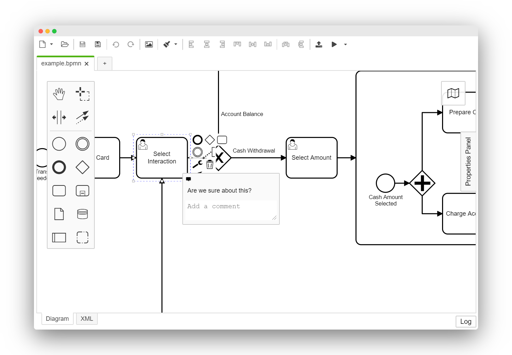

# BPMN Embedded Comments Plugin

 

[Embedded Comments](https://github.com/bpmn-io/bpmn-js-embedded-comments/) as a plugin for the Camunda Modeler.

## Installation

Put this directory into the `plugins` directory of the Camunda Modeler and you're ready to go.

If you're interested in how to create your own plugins see the [documentation](https://docs.camunda.io/docs/components/modeler/desktop-modeler/plugins/) and this [example](https://github.com/camunda/camunda-modeler-plugin-example).

## License

MIT
